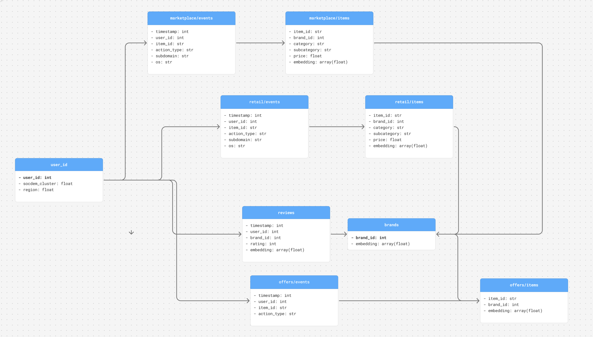

# Описание структуры данных

Для этапа EDA (и в дальнейшем для обучения модели) приняли решение брать «small» датасет, чтобы 
1. Ускорить проверку гипотез и тестирование моделей на небольшом датасете
2. Иметь возможность в будущем смоделировать запуск работы сервиса и протестировать решение на большем наборе данных
3. На первых этапах использовать в работе функционал pandas

Структура датасета имеет вид


```
t-ecd/
├── users.pq
├── brands.pq
├── marketplace/
│   ├── events/
│   │   └── {day}.pq
│   └── items.pq
├── retail/
│   ├── events/
│   │   └── {day}.pq
│   └── items.pq
├── offers/
│   ├── events/
│   │   └── {day}.pq
│   └── items.pq
└── reviews/
    └── {day}.pq

```




## 1. Поведение пользователей на маркетплейсах (папка `marketplace`)

### 1.1. Файлы с событиями (227 файлов)

| Поле | Описание | 
|------|-----|
| `timestamp` | Время совершения события |
| `user_id` | Идентификатор пользователя |
| `item_id` | Идентификатор товара/услуги |
| `action_type` | Тип действия пользователя |
| `subdomain` | Область действия с товаром |
| `os` | Платформа, с которой было совершено действие  |

**Типы действий (`action_type`):**
- `view` - просмотр товара
- `click` - клик по товару
- `like` - лайк товара
- `clickout` - клик с переходом на внешний сайт

**Области действия (`subdomain`):**
- `u2i` (user-to-item) - зона персональных рекомендаций (лента товаров, "вам может понравиться", "новинки")
- `i2i` (item-to-item) - зона к товару ("похожие товары", "с этим товаром часто покупают")
- `catalog` - переход через навигацию/каталог ("Электроника" → "Смартфоны" → "Apple")
- `search` - поиск по сайту
- `other` - другое

**Платформы (`os`):**
- `android`
- `ios` 
- `other`

### 1.2. Файл `items.pq` - информация о товарах
| Поле | Описание | 
|------|-----|
| `item_id` | Идентификатор товара |
| `brand_id` | Идентификатор бренда |
| `category` | Категория товара |
| `subcategory` | Подкатегория товара |
| `price` | Нормализованная цена (от -10 до 10) |
| `embedding` | Векторное представление товара |

## 2. Поведение пользователей в retail-сегменте (папка `retail`)

### 2.1. Файлы с событиями (227 файлов)

| Поле | Описание | 
|------|-----|
| `timestamp` | Время совершения события |
| `user_id` | Идентификатор пользователя |
| `item_id` | Идентификатор товара/услуги |
| `action_type` | Тип действия пользователя |
| `subdomain` | Область действия с товаром |
| `os` | Платформа, с которой было совершено действие  |


**Типы действий (`action_type`):**
- `view` - просмотр
- `click` - клик
- `added-to-cart` - добавление в корзину

**Области действия (`subdomain`):**
- `main` - главная страница сайта
- `catalog` - каталог товаров
- `search` - поиск по сайту
- `item` - карточка товара
- `cart` - корзина

### 2.2. Файл `items.pq`
Информация о товарах, структура идентична файлу в папке `marketplace`

## 3. Взаимодействие с рекламой (папка `offers`)

### 3.1. Файлы с событиями (227 файлов)
| Поле | Описание |
|------|----------|
| `timestamp` | Время совершения события |
| `user_id` | Идентификатор пользователя |
| `item_id` | Идентификатор рекламного предложения |
| `action_type` | Тип действия с рекламой |

**Типы действий (`action_type`):**
- `offer_shown` - предложение показано
- `seen` - предложение просмотрено
- `like` - лайк предложения
- `redirect_to_partner` - переход по ссылке партнера

### 3.2. Файл `items.pq` - рекламные предложения
| Поле | Описание |
|------|----------|
| `item_id` | Идентификатор рекламного предложения |
| `brand_id` | Идентификатор бренда |
| `embedding` | Векторное представление предложения |

## 4. Отзывы пользователей (папка `reviews`)

### 4.1. Файлы с отзывами
| Поле | Описание |
|------|-----|
| `timestamp` | Время оценки |
| `user_id` | Идентификатор пользователя |
| `brand_id` | Идентификатор бренда |
| `rating` | Оценка от 1 до 5 |
| `embedding` | Векторное представление отзыва |

## 5. Таблица пользователей (`users`)

| Поле | Описание |
|------|----------|
| `user_id` | Идентификатор пользователя |
| `socdem_cluster` |  Социально-демографический кластер |
| `region` | Номер региона |

## 6. Таблица брендов (`brands`)

| Поле | Описание |
|------|----------|
| `brand_id` | Идентификатор бренда |
| `embedding` | Векторное представление бренда (название + описание) |


Источники:
1. https://huggingface.co/datasets/t-tech/T-ECD
2. https://habr.com/ru/companies/tbank/articles/950696/